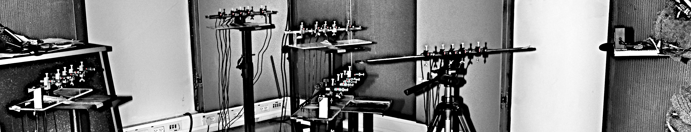
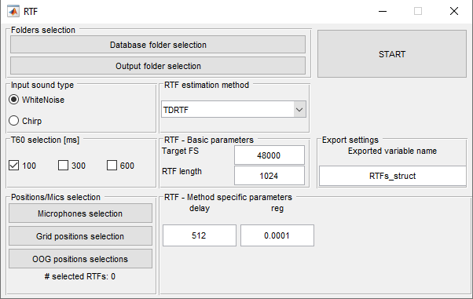
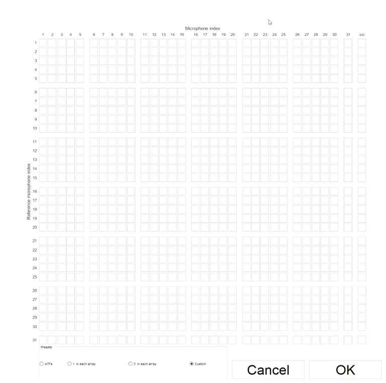
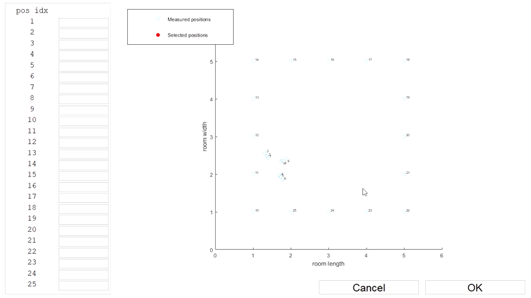

<div align="center">
  


# MIRaGe Database Utilities

[Report Issue][issues] · [Request Feature][issues]

</div>

Purpose of this project is to simplify RTFs | ATFs extraction from MIRaGe sounds database. Database documentation can be found on dedicated webpage:
* [https://asap.ite.tul.cz/downloads/mirage/][MIRaGe]

Software package involves:
* Functions to obtain ATF|RTF: Time-Domain Estimation function
* Matlab GUI app for batch processing (more selected RTF/ATFs at once)
* Unified interface for adding own estimation methods (then usable in GUI)

## Getting Started

### Prerequisities 

All utilities were tested under **Matlab 2017a** or newer both on Linux and Windows platforms.

### Downloading the database
Download instruction can be found on [https://asap.ite.tul.cz/downloads/mirage/][MIRaGe]

### Usage 

There are two ways how to obtain desired ATF|RTF: CLI, GUI.

#### Command-Line 

```matlab
function [g,G] = getRTF(method, t60, loc, mic_idx, ref_mic_idx, ...
                        fs_req, N, input_struct, database_folder, ...
                        phase_corrections, precompute_folder, input_type,oog_or_grid)
    %Function to retrieve an RTF from the Database 
    % 
    % Input: 
    %   method = 'TDRTF', 'other_implemented_method_name'
    %   t60 = Desired t60 level (100, 300 or 600 for real setup; any number for simulated setup)
    %   loc = 3x1 array of coordinates for the source position | 1x1 index of the source position (out of grid) 
    %   ref_mic = id of the reference microphone
    %   target_mic = id of the taret microphone
    %   fs_reg = desired fs for decimation
    %   N = length of the Relative Impulse Response
    %   input_struct = method specific parameters function 
    %   database_folder = input database folder path
    %   phase_corrections = 32x1 array of ones and -ones
    %   precompute_folder = folder path for saving and loading precomputed RTFs 
    %   RTF/ATF
    %   input_type = "WN"|"Chirp"
    %   oog_or_grid = 1|0 - 1:OOG 0:Grid;
    
    % Output:
    %   g = Relative Impulse response
    %   G = Relative Transfer Function
```

The `getRTF(...)` function automatically build up cache folder on harddrive (`precompute_folder` parameter specifies folder of the cache). ATF|RTF extraction with already precomputed data takes just the time to load from harddrive.  

#### GUI

<div align='center'>



</div>

##### Microphones selection preview
<div align='center'>



</div>


##### Positions (inside Grid) selection preview
<div align='center'>


</div>


##### Positions (Out-of-Grid) selection preview
<div align='center'>



</div>

##### Output

Since it is possible to choose multiple ATF|RTFs to compute outputting structure has to contain all of them.

Structure build up:

```matlab
out_struct.method  =  Chosed method name
out_struct.method_params =  structure of parameters for choosed method;
out_struct.RTF_length =  choosed RTF length;
out_struct.target_FS =  choosed target sampling frequency;
out_struct.snd_type =  Chirp | WhiteNoise used for extraction ;

out_struct.data(global_idx).g = computed Relative Impulse Response
out_struct.data(global_idx).pos =  3x1 [x,y,z] - grid | 1x1 [id] - oog   ;
out_struct.data(global_idx).mic = microphone index
out_struct.data(global_idx).ref_mic = reference microphone index
out_struct.data(global_idx).t60 = 100 | 300 | 600 ms
```

In order to simplify searching this structure. We prepared following functions:

* One RTF output

```matlab
function [g, index] = findRTF(structure, pos, mic, ref_mic, t60)
  %Function that returns a specified filter g amd its index within a
  %structure from the MIRaGe software
  %
  %inputs:
  %   structure = structure containing data from the MIRaGe software
  %   pos = position in the grid relative coordinates, e.g. [260, 180, 160]
  %   mic = microphone index (e.g. 31 for on-crane mic) or input sound (32)
  %   ref_mic = reference microphone (e.g. 5)
  %   t60 = reverberation time, e.g. 100
  %
  %outputs:
  %   g = time-domain filter (ATF or RTF)
  %   index = index of the desired filter within the input structure
```
* RTFs tensor output

```matlab
function [g_tensor, selected_map] = struct2tensor(varargin)
  %Function that returns a tensor of specified filters saved within a
  %structure exported from the MIRaGe Utils software
  %
  %Syntax:
  %
  %[g_tensor, selected_map] = struct2tensor(structure)
  %[g_tensor, selected_map] = struct2tensor(structure, mic)
  %[g_tensor, selected_map] = struct2tensor(structure, mic, ref_mic)
  %[g_tensor, selected_map] = struct2tensor(structure, mic, ref_mic, x)
  %[g_tensor, selected_map] = struct2tensor(structure, mic, ref_mic, x, y)
  %[g_tensor, selected_map] = struct2tensor(structure, mic, ref_mic, x, y, z)
  %[g_tensor, selected_map] = struct2tensor(structure, mic, ref_mic, x, y, z, t60)
  %
  %Inputs:
  %   structure = structure containing data from the MIRaGe software
  %
  %   mic = microphones indexes selection, vector of
  %   mic indexes | scalar for one index | ':' select all
  %
  %   ref_mic = references microphones indexes selection, vector of
  %   mic indexes | scalar for one index | ':' select all
  %
  %   x = x axis position in the grid relative coordinates, vector of
  %   positions | scalar for one position | ':' select all
  %
  %   y = y axis position in the grid relative coordinates, vector of
  %   positions | scalar for one position | ':' select all
  %
  %   z = z axis position in the grid relative coordinates, vector of
  %   positions | scalar for one position | ':' select all
  %
  %   t60 = t60 reverberation time selector in ms, vector of
  %   selected t60s  | scalar one t60 | ':' select all
  %
  %Outputs:
  %   g_tensor = time-domain filters (ATF or RTF) tensor
  %
  %   selected_map = selected values of parameters. Order corresponds to g_tensor dimensions
```


#### Preparing own RTF estimator

Use following two steps to implement your own RTF estimator. All RTF estimators must be placed in "RTF_Estimators" folder. Sample solution is shown as "Dummy_RTF_est" estimator.

1) Define function with own implementation of RTF estimator. Structure of the input and output must be preserved as it is in following example.

```matlab
function [g, G] = Dummy_RTF_est(x_ref,x_tar,N,input_struct)
  %[g, G] = Dummy_RTF_est(x_ref,x_tar,rtf_length,input_structure)
  %   inputs: x_ref,x_tar ... signals from microphones
  %           N ... length of the estimated impulse response          
  %           input_struct.dummy_arg1 ... first dummy parameter
  %           input_struct.dummy_arg2 ... second dummy parameter
  %   outputs:
  %           g ... estimated impulse response (N taps long)
  %           G ... estimated RTF

  g = rand(N,1);
  G = fft(g);
end
```
2) Define own set of parameters that will be stored in the matlab structure and propagate into your estimator through fourth input parameter.
Predefined setting will be shown in main GUI.

```matlab
dummy_arg1 = "my string";
dummy_arg2 = 42;
save('Dummy_RTF_est.mat','dummy_arg1','dummy_arg2');
```

Place both files (RTF_function,Parameter_preset) into "RTF_Estimators" folder. Both files need to have same name with different suffix (.m, .mat). 

## Authors

| Name            | E-mail    |
| :---            | :---      |
| Jaroslav Čmejla | jaroslav.cmejla@tul.cz |
| Tomáš Kounovsky | tomas.kounovsky@tul.cz |


[issues]: https://github.com/JarCme/MIRaGe/issues
[MIRaGe]: https://asap.ite.tul.cz/downloads/mirage/
